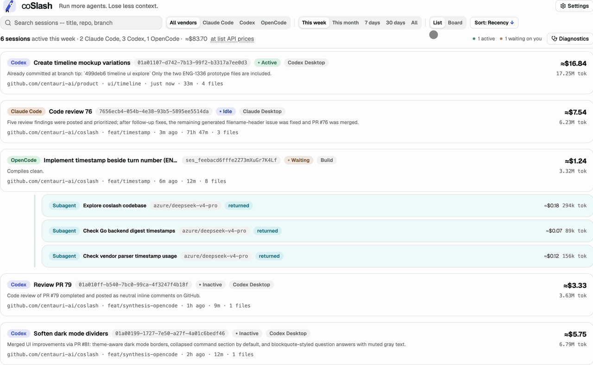
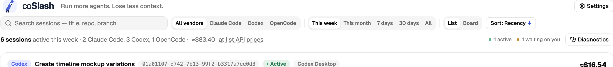
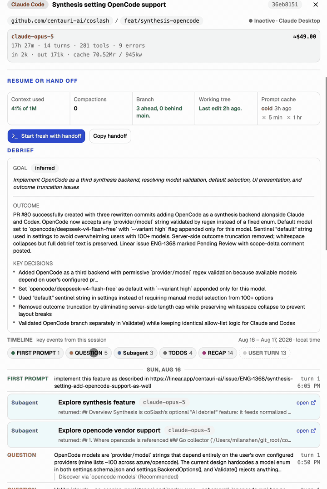
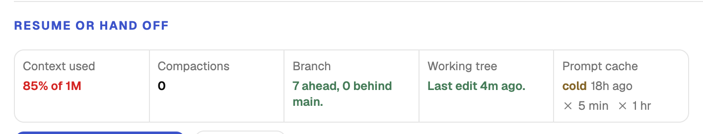
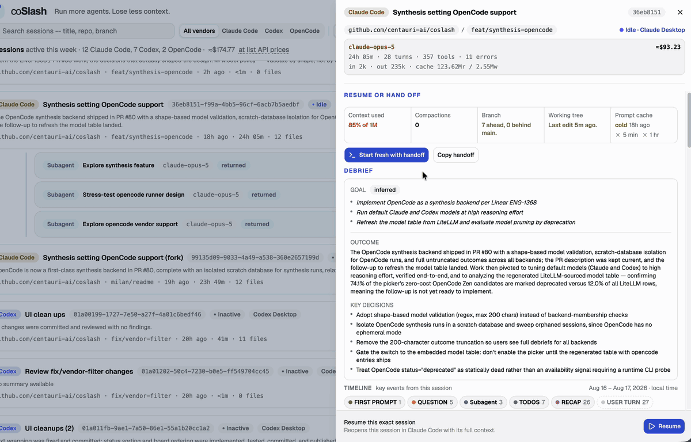
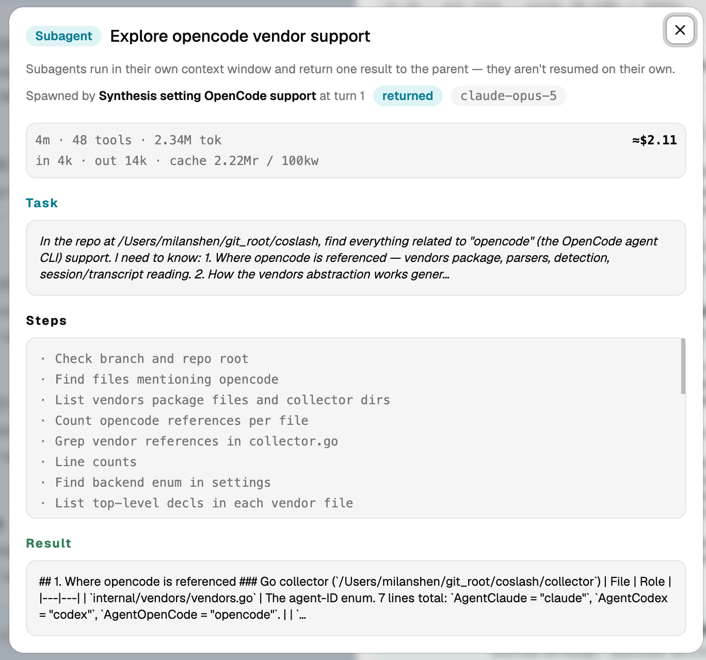
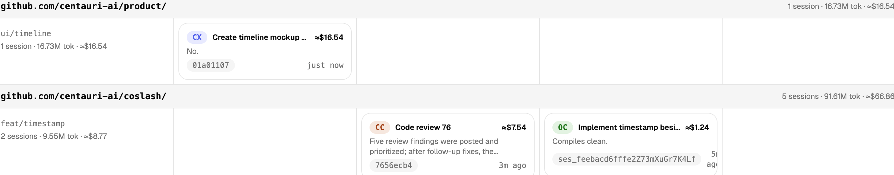
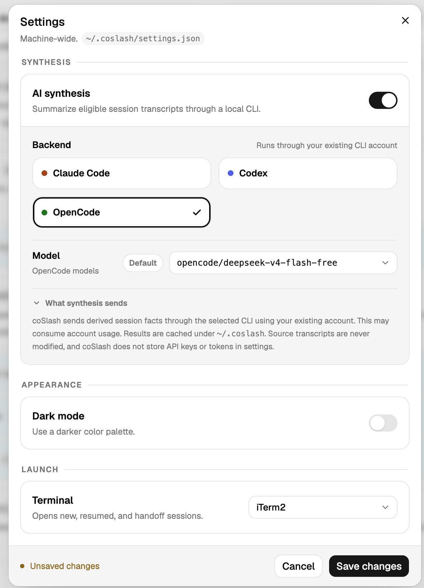

<p align="center">
  <a href="https://coslash.io">
    <picture>
      <source media="(prefers-color-scheme: dark)" srcset="frontend/public/brand/coslash-logo-reverse.svg">
      
    </picture>
  </a>
</p>

<p align="center">
  <b>The attention layer for coding agents. Run more agents, lose less context.</b>
</p>

<p align="center">
  <a href="https://coslash.io"><b>coslash.io</b></a>
</p>

<p align="center">
  <a href="https://github.com/centauri-ai/coslash/actions/workflows/ci.yml"></a>
  <a href="collector/go.mod"></a>
  <a href="frontend/.nvmrc"></a>
  <a href="LICENSE"></a>
  <a href="https://github.com/centauri-ai/coslash/releases"></a>
</p>

Three agents are running. One finished twenty minutes ago, one is waiting on a question you never saw, and one has been quietly compacting its context on a branch whose name you've forgotten. coSlash reads their transcripts straight off your disk and turns them into a single board: what each session set out to do, what it decided, what it changed, and which ones need you next.

Then it gets you back in — resume a session in its own terminal with full context, or copy a handoff brief and pick it up cold somewhere else.

Everything runs locally. Nothing leaves your machine unless you turn on synthesis.

**Early preview · macOS only**

<table>
<tr>
<td><b>Supported agents</b></td>
<td>Claude Code · Codex / ChatGPT · OpenCode · more to come</td>
</tr>
<tr>
<td><b>Works with</b></td>
<td>The desktop apps and the CLIs of each agent</td>
</tr>
<tr>
<td><b>Reads</b></td>
<td>Local transcripts and, optionally, one Linux host over read-only SFTP. No account, no daemon, no telemetry.</td>
</tr>
</table>

## Install

macOS on Apple Silicon or Intel.

```sh
curl -fsSL https://coslash.io/install.sh | bash
```

Or with Homebrew:

```sh
brew install centauri-ai/tap/coslash
```

Then start the server and web app:

```sh
coslash
```

coSlash serves <http://127.0.0.1:8787> and opens your browser with a fresh access token. Use the URL it opens — links from an earlier run stop working once the server restarts.

`brew upgrade coslash` updates it and `brew uninstall coslash` removes the binary. Uninstalling leaves your data in `~/.coslash`; delete that directory separately if you no longer want it.

<details>
<summary>Install a release archive manually</summary>

```sh
VERSION="v0.0.1" # or the desired version tag
ARCH="arm64"  # amd64 on Intel
ASSET="coslash_${VERSION}_darwin_${ARCH}.tar.gz"
BASE_URL="https://github.com/centauri-ai/coslash/releases/download/${VERSION}"
curl -fLO "${BASE_URL}/${ASSET}"
curl -fLO "${BASE_URL}/checksums.txt"
grep -F "  ${ASSET}" checksums.txt | shasum -a 256 -c -
tar -xzf "${ASSET}"
"${ASSET%.tar.gz}/coslash"
```

Release binaries are unsigned. macOS may warn about archives downloaded through a browser; the supported Homebrew install is unaffected.

</details>

### First run

coSlash needs at least one local agent session to read. If it finds none, it says so and runs a checklist of every source it looked at — run `claude`, `codex`, or `opencode` in a repo, take one turn, and re-run the checks. `coslash doctor` prints the same diagnostics from the terminal.

<!-- MEDIA: the first-run screen with the diagnostics checklist. Small, but it's the
     first thing a new user sees and it proves nothing is misconfigured.
     Suggested: docs/media/first-run.png -->

### Optional Linux session monitoring

In **Settings → Machines**, use **Add remote host** with an alias from your
Mac's existing OpenSSH configuration. coSlash checks SSH and SFTP, then installs
and verifies the matching Linux collector. The helper lives in the SSH user's
private `~/.coslash/helpers` directory, has no root or network access, and reads
only supported agent paths. Future coSlash updates replace a helper that it
previously installed and verified; first-time setup always requires this action.

coSlash uses the system `ssh` client and may reuse a control socket under
`~/.coslash/ssh`; it never edits your SSH config. SFTP remains the visible
fallback if a helper cannot run. An offline host is checked promptly and retried
in the background; use **Retry setup** for an immediate attempt. **Remove**
stops monitoring locally even when the host is offline and leaves its helper on
the remote machine.

Remote v1 is monitoring-only. Cards, transcript-derived facts, costs, tokens,
file-edit summaries, and **Copy handoff** are available. Resume, Start Fresh,
diffs, synthesis, preview, Commands, and sharing remain local-only. A remote
session can show recent transcript activity while process liveness is unknown;
coSlash labels those facts separately.

## What you get

### One board for every agent

Claude Code, Codex, and OpenCode sessions land in the same place, whether they came from a desktop app or a CLI. **List view** gives you a full card per session; **board view** groups sessions by repository and branch, with a column per state, so a repo with four parallel branches reads as four rows instead of a scroll.

Search by title, repo, or branch. Filter by vendor and by time window (this week, this month, 7 days, 30 days, all). Sort by recency, estimated cost, tokens, or duration. The list refreshes itself every minute, so statuses and "3 min ago" stay honest without a reload.

<p align="center">
  
</p>

### States that tell you where to look

Every session sits in one of four states, and the header keeps a running count of the two that matter:

- **Active** — the agent is working right now.
- **Waiting** — it stopped and needs an answer from you.
- **Idle** — the session is live but nothing is happening.
- **Inactive** — no live process; this is history you can still mine.

<p align="center">
  
</p>

### An inspector that saves you from reading the transcript

Open any session and you get a reconstruction instead of a log:

- **Debrief** — the goal, the outcome, and up to five key decisions. A badge tells you where the goal came from: *declared* by you, *inferred* from the session, or the raw *first prompt* as a floor.
- **Timeline** — first prompt, your turns, questions the agent asked, todo updates, recaps, compactions, and subagent spawns, each stamped with its turn. Click a category chip to show or hide that kind of event.
- **Artifacts** — files changed with per-file `+/−` and edit counts, commits, PRs, open and completed todos, and every shell command the session ran.
- **Header facts** — model (and any model it switched from), turns, tool uses, errors, runtime, token breakdown, and whether the run was interactive or an autonomous SDK/exec run.

<p align="center">
  
</p>

### Resume readiness, before you commit to resuming

Picking a session back up is not always the cheap option. Before you decide, coSlash shows five things side by side:

- **Context used** — how full the window is, color-coded as it approaches the ceiling.
- **Compactions** — how many times this session has already been squeezed.
- **Branch** — commits ahead of and behind the base branch.
- **Working tree** — how long since anything was edited.
- **Prompt cache** — warm or cold, with the 5-minute and 1-hour windows marked.

A session that's 90% full, compacted twice, and 40 commits behind `main` is telling you to start fresh. One that's warm and 30% full is telling you to just resume.

<p align="center">
  
</p>

### Three ways back in

- **Resume** reopens the exact session in its own CLI, in its working directory, in your terminal of choice, with its full context intact.
- **Start fresh with handoff** writes a Markdown brief — objective, current state, key decisions, timeline, files, commits, next steps, environment — and opens a new session with it loaded as background context. The brief is explicitly marked as reference, so the new agent waits for your instruction instead of charging off on stale notes.
- **Copy handoff** puts the same brief on your clipboard for a PR description, a standup, a ticket, or another machine entirely.

Terminal launches use Apple Terminal or iTerm2, whichever you pick in Settings.

<p align="center">
  
</p>

### Subagents, not just sessions

Subagents appear on a rail under the parent that spawned them, with their model, status, tokens, and cost. Open one to see the task it was handed, the commands it ran, and the result it returned to its parent — the part that usually disappears into a single collapsed line in the transcript.

<p align="center">
  
</p>

### Tokens and cost you can actually audit

Per-model token breakdowns including cache reads and writes, estimated cost at list API prices, and totals rolled up per branch, per repo, and across the whole window. Models with no verified price are excluded from the total and flagged rather than guessed at, so the number is never quietly wrong. OpenCode sessions report their recorded cost instead of an estimate.

<p align="center">
  
</p>

### Optional AI synthesis

Debriefs work without any model: goals, outcomes, timelines, and artifacts are derived deterministically from the transcript. Turning on synthesis sharpens them.

When you enable it, coSlash passes a bounded set of derived facts — goal candidates, digest, todos, filenames, commits, and stats, capped at roughly 12 KB — through your local Claude Code, Codex, or OpenCode CLI, using the account that CLI already has. Results are cached under `~/.coslash`. Only substantial sessions qualify (more than five turns, at least one compaction, or a large context), so short throwaway runs never cost you anything.

For OpenCode, the model list offers the free OpenCode Zen models — defaulting to `opencode/deepseek-v4-flash-free`, run at its `high` reasoning variant — plus *Whichever model OpenCode is set to use*. That option passes no model, so OpenCode resolves one itself: the `model` key in `~/.config/opencode/opencode.jsonc` if set, otherwise the model last selected in the OpenCode CLI. It is the way to reach a paid provider, since OpenCode resolves those from ambient credentials and listing them runs to hundreds of entries — but note the model can then change as you switch models in the CLI, and a paid one will bill your account per debrief.

It is **off until you explicitly enable and save it**.
<p align="center">
  
</p>

## Settings and data

Settings live behind the top-right button and are stored machine-wide in `~/.coslash/settings.json` — synthesis backend and model, light or dark theme, the terminal used for local launches (Apple Terminal or iTerm2), and one optional SSH alias. See [`settings.schema.json`](settings.schema.json) for the file format.

The dialog offers a short model list per backend, but the model is not restricted to it. Editing `settings.json` directly accepts any model the selected CLI can actually reach — including one served through an API proxy such as `ANTHROPIC_BASE_URL`, or a third-party provider — so long as that CLI is set up to resolve it.

Transcripts are read-only; coSlash never modifies local or remote agent data. Cached summaries, temporary local handoffs, and normalized remote facts live under `~/.coslash`. Raw remote transcript bytes are not persisted. The server is loopback-only and protects every API request with an access token minted at start.

Read [Data and privacy](docs/data-and-privacy.md) before pointing coSlash at sensitive transcripts.

## Command reference

| Command | Effect |
| --- | --- |
| `coslash` | Start the server and open the app. |
| `coslash --port N` | Use another loopback port. |
| `coslash --no-open` | Do not open the browser. |
| `coslash --version` | Print the version. |
| `coslash doctor` | Check session sources, agent CLIs, and local storage. |
| `coslash doctor --json` | Print the same diagnostics as JSON — a shareable report. |

## Develop

Building from source requires **Go 1.26+** and **Node 24+** (see `collector/go.mod` and `frontend/.nvmrc`). End users do not need these tools — use [Install](#install) above for a prebuilt binary.

The Go collector and local API live in `collector/`; the React, Vite, and Tailwind UI lives in `frontend/`.

```sh
cd collector
make release
./bin/coslash
```

If `make release` reports a missing or unsupported Go or Node version, install the toolchain first or switch to the curl/Homebrew install path.

See [Contributing](CONTRIBUTING.md) for the development loop and checks.

## Project status

coSlash is an early preview built by its maintainers. The source is public for transparency, local builds, and product feedback. Bug reports are welcome through [Issues](https://github.com/centauri-ai/coslash/issues) — please redact transcripts, prompts, and paths first. Unsolicited pull requests are not accepted; see [Contributing](CONTRIBUTING.md).

## Help

- [Troubleshooting](docs/troubleshooting.md)
- [Data and privacy](docs/data-and-privacy.md)
- [Contributing](CONTRIBUTING.md)
- [Security policy](SECURITY.md)

## License

[MIT](LICENSE)
