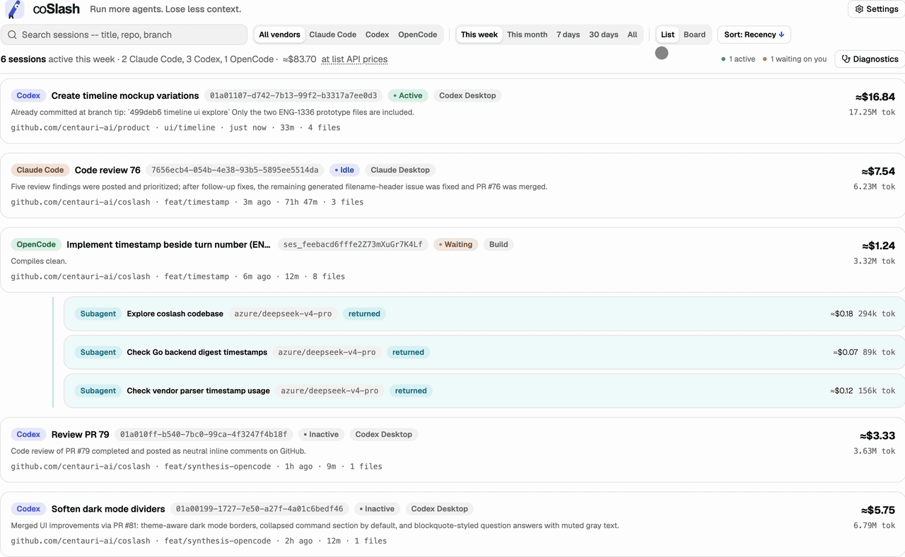
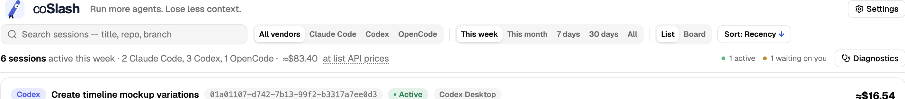
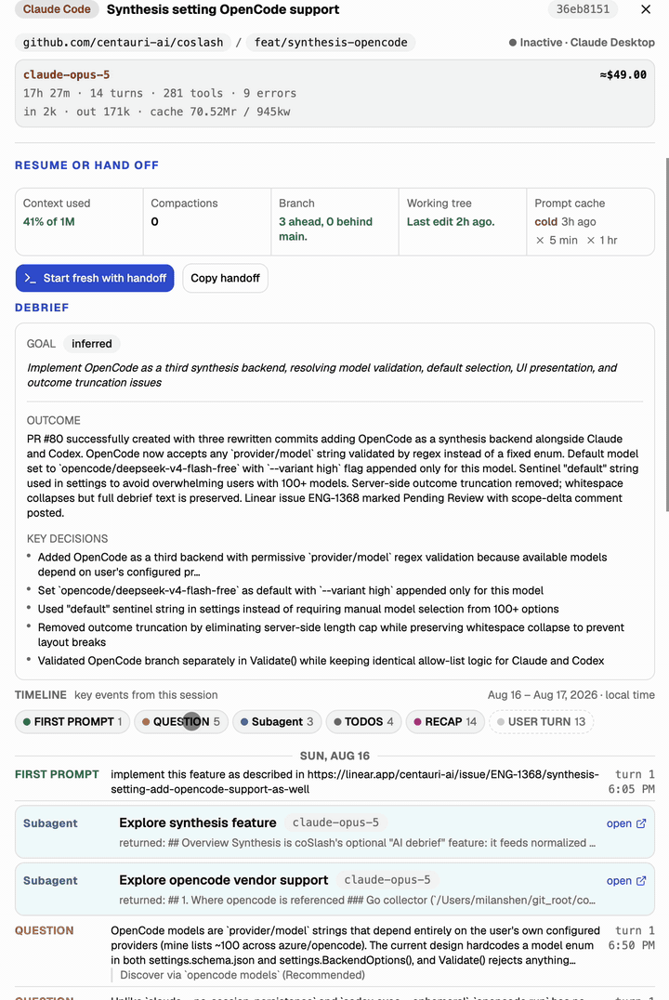
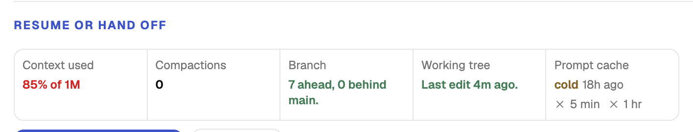
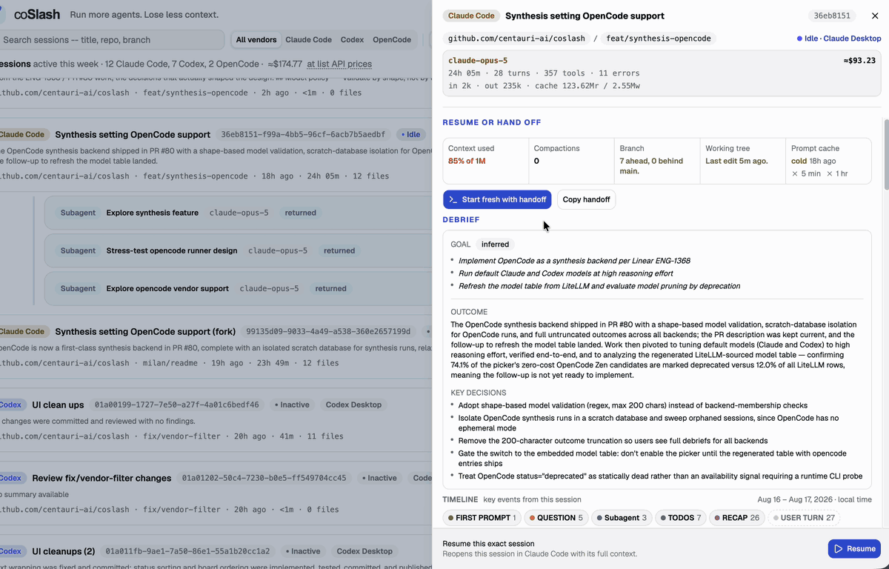
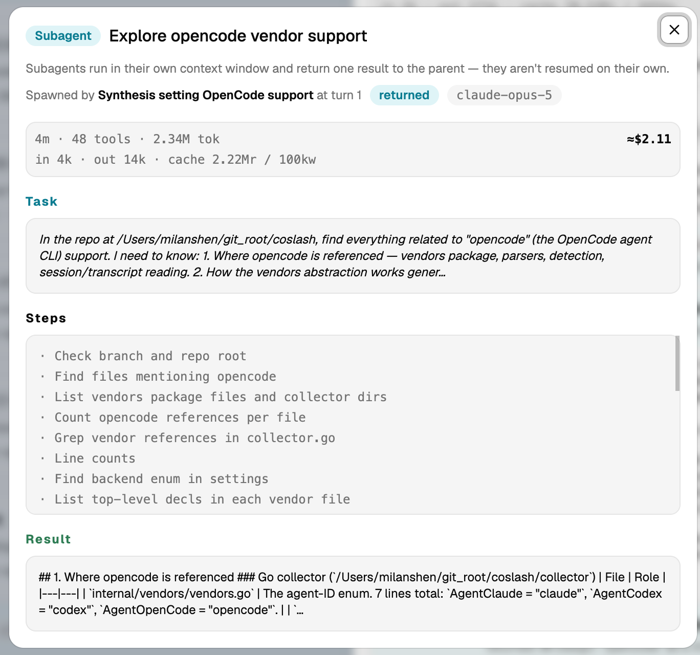
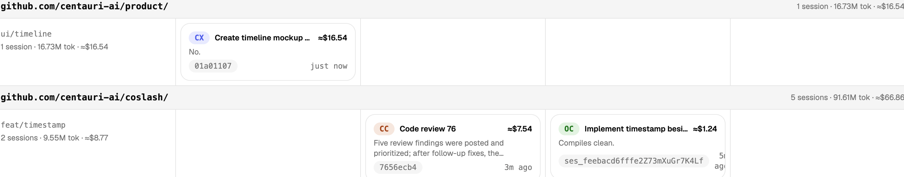
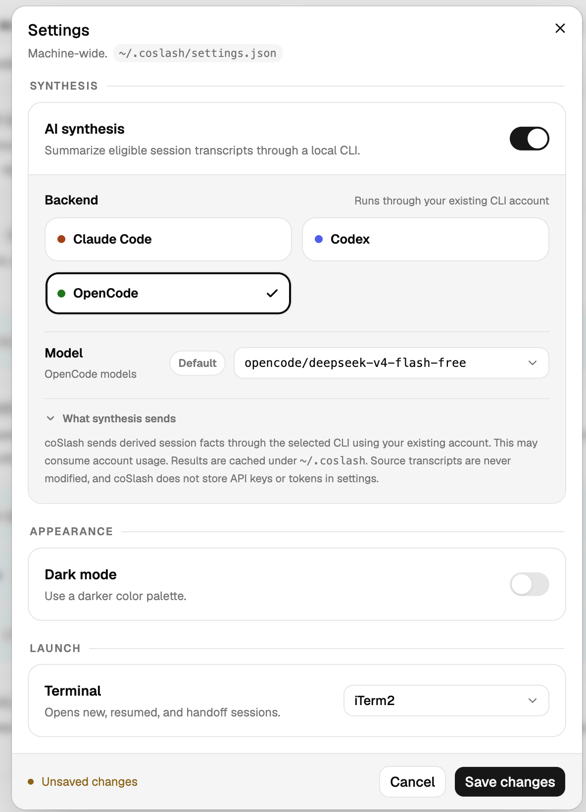

[](https://coslash.io)

**The attention layer for coding agents. Run more agents, lose less context.**

[coslash.io](https://coslash.io)

[](https://github.com/centauri-ai/coslash/actions/workflows/ci.yml)
[](collector/go.mod)
[](frontend/.nvmrc)
[](LICENSE)
[](https://github.com/centauri-ai/coslash/releases)

Three agents are running. One finished twenty minutes ago, one is waiting on a question you never saw, and one has been quietly compacting its context on a branch whose name you've forgotten. coSlash reads their transcripts straight off your disk and turns them into a single board: what each session set out to do, what it decided, what it changed, and which ones need you next.

Then it gets you back in: resume a session in its own terminal with full context, or copy a handoff brief and pick it up cold somewhere else.

Everything runs locally. Nothing leaves your machine unless you turn on synthesis or explicitly approve a Hub share.

**Early preview · macOS and Windows 11 amd64**

| Agent | Supported OS | Local sessions | Linux over SSH | Resume |
| --- | --- | --- | --- | --- |
| Claude Code | macOS, Windows | Desktop App, CLI | Yes | Yes |
| Codex / ChatGPT | macOS, Windows | Desktop App, CLI | Yes | Yes |
| Cursor | macOS, Windows | Desktop App, CLI | No | CLI only. **Open Cursor** reopens the folder of a Desktop App chat. |
| OpenCode | macOS, Windows | Desktop App, CLI | No | Yes |
| Pi | macOS, Windows | CLI | No | Yes |
| Grok Build | macOS, Windows | CLI | No | Yes |

No account, no daemon, no telemetry.

## Install

### macOS

```sh
curl -fsSL https://coslash.io/install.sh | bash
# or
brew install centauri-ai/tap/coslash
```

Then start the server and web app:

```sh
coslash
```

coSlash serves <http://127.0.0.1:8787> and opens your browser with a fresh access token. Use the URL it opens. Links from an earlier run stop working when the server restarts.

`brew upgrade coslash` updates it and `brew uninstall coslash` removes the binary. Your data stays in `~/.coslash` until you delete that directory. To install a specific version from a release archive, see [Install from a release archive](docs/install.md).

### Windows

Download `coslash-windows-amd64.exe` from the newest stable [release](https://github.com/centauri-ai/coslash/releases) that includes it, or from the newest prerelease if no stable release does. Double-click it. coSlash runs as a portable application and opens its UI in your browser. It needs no administrator privileges, WSL, Go, Node, or GNU tools.

To upgrade, replace the executable with a newer one. To uninstall, delete it. Your data stays in `~\.coslash`. The executable is not code-signed. To verify its checksum, see [Install from a release archive](docs/install.md#windows). The supported baseline is Windows 11 24H2 amd64 ([Windows validation](docs/windows-validation.md)).

### First run

coSlash needs at least one local agent session to read. If it finds none, it shows a checklist of every source that it looked at. Take one turn in a supported agent in a repo, then run the checks again. `coslash doctor` prints the same diagnostics in the terminal.

Pi needs a managed extension for live status, which coSlash installs on startup. Restart running Pi processes after that. For Pi versions, custom session directories, and status details, see [Troubleshooting](docs/troubleshooting.md#pi-sessions-and-runtime-status).

### Linux sessions over SSH

In **Settings → Machines**, choose **Add remote host** and enter an alias from your OpenSSH configuration or a `user@host` destination. coSlash uses the system `ssh` client and never edits your SSH configuration. After you approve it, coSlash installs a small read-only helper in `~/.coslash/helpers` on the host. If the helper cannot run, coSlash falls back to SFTP.

Remote Claude Code and Codex sessions support **Resume** and **Start fresh with handoff** while the host is connected. Cached sessions stay readable while the host is offline. Synthesis and Commands are local-only. For setup errors, see [Troubleshooting](docs/troubleshooting.md#sessions-are-missing).

## What you get

### One board for every agent

Sessions from every supported agent land in the same place, whether they came from a desktop app or a CLI. **Table view** gives you a compact, title-first row per session with vendor, activity, machine, resume readiness, update time, and cost aligned for comparison. **Board view** groups sessions by repository and branch, with a column per state, so a repo with four parallel branches reads as four rows instead of a scroll.

Search by title, repo, branch, agent, prompt, recap, summary, goal, or synthesis. Filter by state, machine, vendor, folder, and time window, and sort by recency, title, or estimated cost. The list refreshes itself every minute, so statuses and "3 min ago" stay honest without a reload.



### States that tell you where to look

- **Active**: the agent is working right now.
- **Waiting**: it stopped and needs an answer from you.
- **Idle**: the session is live but nothing is happening.
- **Inactive**: no live process. This is history you can still mine.
- **Unknown**: coSlash has no reliable runtime evidence.



### An inspector that saves you from reading the transcript

Open any session and you get a reconstruction instead of a log:

- **Debrief**: the goal, the outcome, and up to five key decisions. A badge tells you where the goal came from: *declared* by you, *inferred* from the session, or the raw *first prompt* as a floor.
- **Timeline**: first prompt, your turns, questions the agent asked, todo updates, recaps, compactions, and subagent spawns, each stamped with its turn. Click a category chip to show or hide that kind of event.
- **Artifacts**: files changed with per-file `+/−` and edit counts, commits, PRs, open and completed todos, and every shell command the session ran.
- **Header facts**: model (and any model it switched from), turns, tool uses, errors, runtime, token breakdown, and whether the run was interactive or an autonomous SDK/exec run.



### Resume readiness, before you commit to resuming

Picking a session back up is not always the cheap option. Before you decide, coSlash shows five things side by side:

- **Context used**: how full the window is, color-coded as it approaches the ceiling.
- **Compactions**: how many times this session has already been squeezed.
- **Branch**: commits ahead of and behind the base branch.
- **Working tree**: how long since anything was edited.
- **Prompt cache**: warm or cold, with the 5-minute and 1-hour windows marked.

A session that's 90% full, compacted twice, and 40 commits behind `main` is telling you to start fresh. One that's warm and 30% full is telling you to just resume.



### Three ways back in

- **Resume** reopens the exact session in its own CLI, in its working directory, in your terminal of choice, with its full context intact.
- **Start fresh with handoff** opens the original agent with the generated notes, ready for your next message. For a review or a custom request, choose an installed destination agent. coSlash sends the brief and the task, then tracks the new session and its result.
- **Copy handoff** puts the same brief on your clipboard for a PR description, a standup, a ticket, or another machine entirely.

Interactive handoffs on macOS and Linux need the system `expect` command. On macOS and Windows, Grok Build is also a handoff and review destination after you log in to it. On Windows, a Grok review can read files outside the worktree. Read [Data and privacy](docs/data-and-privacy.md) before you use it.



### Subagents, not just sessions

Subagents appear on a rail under the parent that spawned them, with their model, status, tokens, and cost. Open one to see the task it was handed, the commands it ran, and the result it returned to its parent: the part that usually disappears into a single collapsed line in the transcript.



### Tokens and cost you can actually audit

Per-model token breakdowns including cache reads and writes, estimated cost at list API prices, and totals rolled up per branch, per repo, and across the whole window. Models with no verified price are excluded from the total and flagged rather than guessed at, so the number is never quietly wrong. OpenCode sessions report their recorded cost instead of an estimate.

**Insights** shows one month at a time: the agents and models in use, the top repositories, and sessions per day. Its cost panel separates the coding cost of sessions last active in that month from the cost of synthesis runs that started in that month, and adds the known amounts together. In the inspector, **Synthesis rounds** lists each synthesis run for that session with its model, tokens, and cost. Synthesis cost history stays in `~/.coslash` and covers local runs only.



### Optional AI synthesis

Debriefs work without any model: goals, outcomes, timelines, and artifacts are derived deterministically from the transcript. Turning on synthesis sharpens them.

When enabled, coSlash passes no more than 12 KB of derived facts to a local agent CLI: Claude Code, Codex, OpenCode, Cursor, Pi, or Grok Build. Each CLI uses its existing account, and a paid model bills that account. Only substantial sessions qualify, so short runs do not use a model. Results are cached under `~/.coslash`. For the model options of each backend, see [Synthesis backends](docs/synthesis.md).

It is **off until you explicitly enable and save it**.



## Settings and data

Settings are stored machine-wide in `~/.coslash/settings.json` ([schema](settings.schema.json)). Use the top-right theme controls for light or dark mode. Use **Settings** for the synthesis backend and model, the launch terminal, and remote hosts. On macOS, the terminal is Apple Terminal or iTerm2. On Windows, coSlash uses Windows Terminal when it is available, otherwise Windows PowerShell.

Transcripts are read-only: coSlash never modifies local or remote agent data. Cached summaries, temporary handoffs, and normalized remote facts live under `~/.coslash`. Raw remote transcripts are not stored. The server listens only on loopback and protects every API request with an access token that it creates at start.

Read [Data and privacy](docs/data-and-privacy.md) before you point coSlash at sensitive transcripts.

## Command reference

| Command | Effect |
| --- | --- |
| `coslash` | Start the server and open the app. |
| `coslash --port N` | Use another loopback port. |
| `coslash --no-open` | Do not open the browser. |
| `coslash --version` | Print the version. |
| `coslash sessions [query] --json` | List local sessions as JSON. The query filters by title, repository, branch, or agent. An exact session ID or `<agent>:<session>` selector returns only that session. |
| `coslash handoff <agent>:<session>` | Print the handoff Markdown for a selector from `coslash sessions`. |
| `coslash send <agent>:<session> --to claude\|codex\|opencode\|cursor\|pi\|grok [message]` | Start the target agent in the working directory of the session, with the handoff and an optional first task. For Cursor, coSlash copies both to the clipboard. Paste them into the new Cursor CLI session. |
| `coslash review <agent>:<session> --with claude\|codex\|opencode\|cursor\|pi\|grok` | Start a review of a local session with an installed agent. |
| `coslash doctor` | Check session sources, agent CLIs, and local storage. |
| `coslash doctor --json` | Print the same diagnostics as JSON, as a shareable report. |

`sessions`, `handoff`, `send`, and `review` need the app to be running. Results go to standard output. Failures write `Error: <message>` to standard error and exit non-zero. The commands find the access token of the running app locally and never print it.

### Agent skills

Install the five coSlash skills for Claude Code:

```sh
claude plugin marketplace add centauri-ai/coslash#stable
claude plugin install coslash@centauri-ai
```

Or for Codex:

```sh
codex plugin marketplace add centauri-ai/coslash --ref stable
codex plugin add coslash@centauri-ai
```

Or for Grok:

```sh
grok plugin install centauri-ai/coslash@stable#plugins/coslash --trust
grok plugin enable coslash
```

Or for Cursor CLI, OpenCode, and Pi:

```sh
npx skills@latest add centauri-ai/coslash -g -a cursor -a opencode -a pi --skill '*' -y
```

The skills call the `coslash` executable, so it must be on `PATH`. The `sessions`, `handoff`, `send`, and `review` skills start the app when it is stopped. `doctor` works without starting it. The `stable` branch moves with each stable release. When you update coSlash, update the skills too: `claude plugin marketplace update centauri-ai` then `claude plugin update coslash@centauri-ai`, `codex plugin marketplace upgrade`, `grok plugin update coslash`, or `npx skills@latest update -g`. On Windows, if `npx skills` fails on a symlink, rerun the same command with `--copy`.

If you use a custom `COSLASH_HOME` with Codex, a `shell_environment_policy` in `~/.codex/config.toml` can drop it. Set it under `[shell_environment_policy.set]` as `COSLASH_HOME = "<path>"`. `coslash doctor --json` shows the `storage.home` that the skills use.

## Development

Building from source needs **Go 1.26+** and **Node 24+** (see `collector/go.mod` and `frontend/.nvmrc`). The Go collector and local API live in `collector/`. The React, Vite, and Tailwind UI lives in `frontend/`.

```sh
cd collector
make release
./bin/coslash
```

See [Contributing](CONTRIBUTING.md) for the development loop and checks.

## Project status

coSlash is an early preview built by its maintainers. The source is public for transparency, local builds, and product feedback. Bug reports are welcome through [Issues](https://github.com/centauri-ai/coslash/issues). Redact transcripts, prompts, and paths first. Unsolicited pull requests are not accepted. See [Contributing](CONTRIBUTING.md).

## Help

- [Troubleshooting](docs/troubleshooting.md)
- [Data and privacy](docs/data-and-privacy.md)
- [Current product baseline](docs/current-product-baseline.md)
- [Contributing](CONTRIBUTING.md)
- [Security policy](SECURITY.md)

## License

[MIT](LICENSE)
